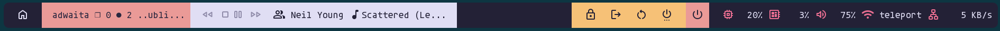
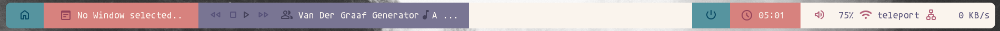

# [Polybar](https://github.com/polybar/polybar) with [rose-pine theme](https://rosepinetheme.com/)

## not up to date..

This polybar ist based on an example bar with some modifications and adjustments and rose pine colors.



You will need some fonts, so..

```
font-0 = agaveNerdFont:size=14;3
font-1 = MaterialSymbolsRounded:size=18;2
font-2 = monospace:size=14;1
```

Also to setup the lock, logout.. actions and the menu used is rofi.
(Btw. there is also a rose pine theme for rofi.)

You also have to setup your own mpd server and client..

And here is the dawn version:



**Caution**: the Screenshots are not up to date.. and the dawn version is far ahead.
